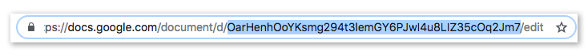

# Getting Data Into Your Interactive

PIB treats all kinds of external data the same once it's downloaded to make your work as a developer easier. This includes data hosted S3, from Kitchen Sink, or even from Google Docs.

## Registering Data

The first thing to do is register your data source. This will differ slightly depending on the source.

### Registering Google Docs \(Archie & Spreadsheet\)

Before registering, create a new Google Doc in [this folder](https://drive.google.com/drive/folders/1LwuTm5ueV-gvIma0Up5opkbUqK0WTbmV). You should also create a folder for your project and place any docs in there. The docs will automatically be shared with the whole team.

If you're unable to save the doc in our shared folder, make sure to share it with the team's service account the same way you would share a doc with any other Google user \(you can read more about [Google Service Accounts here](https://cloud.google.com/iam/docs/understanding-service-accounts)\):

```text
politico-interactives@politico-interactives-228617.iam.gserviceaccount.com
```

To register the Google Doc, run the following:

```text
$ yarn api new
```

It’ll first ask you for a name. Name it, but refrain from using spaces in the name to make importing it into your JavaScript easier.

Next, choose `Archie Doc` or `Google Sheet` as the type.

Finally, paste the ID of your Google doc. You can find it in the URL between `d/` and `/edit` like this:



### Registering JSON Data \(including Kitchen Sink\)

To register a raw JSON source, run the following:

```text
$ yarn api new
```

It'll first ask you for a name. You can name it anything you'd like, but you should probably refrain from using spaces to make importing it into your JavaScript easier.

Next, choose `JSON File` as the type.

Finally, paste the URL to your file.


## Using The Data

Once you've registered the data source, using it is the same. In your JavaScript file, first import it using the `Data` alias and the name you gave your endpoint \(see [Aliases](aliases.md) for more on using aliases\):

```javascript
import data from 'Data/data.json';
```

Then you can use it like any object. If it's array, you might consider mapping its data into HTML elements in your JSX like this:

```javascript
<ul className="candidates">
  {data.map(d => (
    <li className="candidate">{d}</li>
  ))}
</ul>
```

## Updating The Data

When data is downloaded, it will remain unchanged until you manually update it. To update all of your endpoints run:

```text
$ yarn api download
```

You can also update only one specific endpoint by passing the name you gave that endpoint as a final argument. For example, if the name of your endpoint is `data`, you can run:

```text
$ yarn api download data
```

