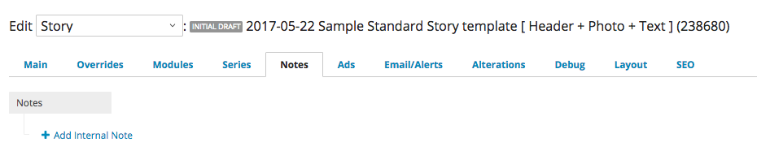

# Publishing a project

### 🛑 Red lines 🛑

Before we talk about how you should publish a project, you need to know when you _shouldn't_ publish one.

These guidelines are here to **stop you** from publishing a page that hasn't passed the minimum conditions for safety on our desk. Any project failing them should not be published or promoted.

These guidelines help check you on deadline, but they also **protect you** from pressures around the newsroom. If you're under pressure from a more senior editor, direct that editor to these rules and loop in the Interactive News editor immediately.

**These are our red lines:**

* All code must be on GitHub before it's on politico.com.
* All pages must pass an edit on the Interactive News desk, no matter who \(or how senior\) other editors are.
* Untested code is broken code. Every page must pass functionality and design tests across our minimum testing devices before it's promoted.
* The copy desk reads all Interactive News pages. Only in extreme cases should they back-edit our work. \( 💬Chats are the only exception to this rule.\)

_**Are you an editor who's been directed to these guidelines???**_

👋 Welcome. We know you're on deadline, so we'll make this brief.

All Interactive pages are a mix of both the content and the technical presentation. In an Interactive, those technical details must be edited by a qualified editor just like copy. Part of committing to an interactive page is committing to that extra overhead. We work fast, but making sure our code works for _all_ our readers protects POLITICO's brand and our team's journalism.

Interactive News will not publish any page if we are not sure we can stand behind the code. We'll work as quickly as we can to get your page up. Thank you for your patience and reach out to the Interactive News editor for more details.

### Minimum testing devices

Test your code against these devices, **even on deadline**.

**Desktop**

* Latest version of Chrome
* Latest version of Firefox

👉 Test all pages at several breakpoints. Start with Bootstrap defaults: 1200, 992 & 768 pixels wide.

**Mobile**

* iPhone 
* Android

👉 Remember your newsroom, especially your editors, do not represent your readers: **A majority of Americans prefer Android phones.** Test your code where your readers are.

------------------------------------------------------------------------------------------

Some simple guidelines for what to do before you hit the big red button.

#### Editing process

An Interactive News editor signs off on all projects before they are published or deployed to master. See the publishing checklist below for details.

**Design reviews**

An editor will conduct a dedicated UX and design review with you, but editing interactive components should be an iterative process. Show your work early and often to an editor and the final edit will go much more smoothly.

[https://www.gitbook.com/book/politico/politico-newsroom-developer-guide/edit\#\#\#\#\#\#](https://www.gitbook.com/book/politico/politico-newsroom-developer-guide/edit)

**Code reviews**

Code reviews are required for medium and long-turn projects and for any project touching durable infrastructure like datalab. The format these will take is fluid based on the project.

### Publishing checklist

Make sure you've done all these things on your project before you publish.

#### Copy editing

* [ ] Ensure that your project has been copy-edited by the correct desk. For Core stories `tp-copydesk@politico.com`. For **PRO stories** `tp-proweb@politico.com`. 

#### Meta tags

* [ ] Double check that your `meta.json` file is completely filled out.
* [ ] Triple check that you have the `publishPath` and `url` correctly configured in your publish path.
* [ ] Create a social share image at 600 x 325px, named share.jpg in the `dist/images` directory on interactive pages.

### Documentation

* [ ] Update the README in your project.
* [ ] If you're deploying an app or tool, make sure to add a `Developing` docs section with full instructions for anyone on the team to spin up your project locally.

### Github

* [ ] **Create a private repo for your project and push your latest code \(which you should do daily, tbh\).**
* [ ] Prefix interactive and embed repo names with `interactive_` or `embed_`, respectively.
* [ ] Talk with your editor about whether we will make this repo public after publishing.
* [ ] If you're working on an existing project, push your code to a branch which will be merged into master after a code review with your editor.

### **Make a story shell in the cms**

Here’s how to create a shell for Interactives:

* go to the cms
* Create “Shell article”
* Put the URL of the interactive in the URL field
* Put the headline in the Headline field
* Put the Dek \(if there is one\) in the Dek and Tease fields
* Attach a photo/gif/illustration \(the interactives team may provide this\)
* Add the reporters who are listed on the interactive to the Byline
* Give in the Flag “Interactives”
* Give it a Category
* Use all applicable tags for the shell, like you would any other article. Included in the tags should be **“Interactives,”** which will keep all of those graphic stories on a separate tag page and create an icon for the homepage when the interactive is displayed.
* Publish. 

### Notify

#### →  Homepage

All of our stories will move through the homepage. We want them to look their best. Here's how:

#### For Interactives

Email `webteam@politico` \[this includes webeditors, web producers and social\], include the following

If you're working with the pro team, cc them on this email at `tp-proweb@politico.com`

_**Story info section**_

* Send them a link and the ID of your story shell.
* Run date and time
* Headline, please note if it is not finalized
* Dek, if applicable
* The live url
* Preview url, if not live
* Please outline _if_ alert should be sent. Not sure? Ask the editor.
  * Include alert text, if you have it
* Homepage editors will select lede art for the HP display. The aspect ratio of the image is **16x9** or **1160x773**
* If you are working on a graphic, please attach 1-2 options for when the story moves out of the lede spot and into the _b section_.
  * These should be cut to **1160x773**, but will run at a width of ~200px. 
    * Images should have minimal text 
    * They should clearly suggest to the reader that the story has graphical elements. Ie:

      

      

_**Social Medial section**_

* Include a section tiled **For Sosh**. 
  * Attach images, gifs, videos that social media can use. 
  * Want to make a gif of the experience you've built? Consider downloading [licecap](https://www.cockos.com/licecap/). 

_**Producer section**_

If the graphic is something you'd like to be included in other stories, include a line for producers asking them to include it as a parenthetical.

...

#### _Sample Interactive email to webteam@politico.com_

* Hello web team,  we have an interactive page going live for promotion on **Monday Jan, 1 at 5am**. It will need a story shell. 

**Headline**: TK  
**Dek**: TK  
**Live url will be:** TK.com  
**Preview the story here:** [aws bc](http://ngrok.politico.com.io/)

* **Login:** _\*\*put the login here_
* **Pass:** _\*\*put the password here_

**B-section thumbnails:** Two options attached

-

**For Sosh**  
Please see attached social media assets.

**For Producers**  
Please include this graphic as a parenthetical in related stories

Please contact `interactivenews@politico.com` with any questions/concerns. Thanks,

**YourName** 

#### For Embeds

There are **two ways** to get an embed into a story. You **do not need** a story shell for these.

**In most cases:**

* Send your `iframe` embed code to the reporter and have them include it with their email to the web team.
  * Send it along with this note:
    * "Please include this embed code with your note to the web team. Ask them to embed it as an `enhancement` into the story. You may specify where you'd like it to go, if you have a placement in mind.

**For more complicated builds:**

* Embed the code yourself once the reporter is out of the story. To do so, follow [these steps](https://politico.gitbooks.io/politico-newsroom-developer-guide/content/tipsheets/cms-embeds/plugging-your-embed-into-the-cms.html)
  * In the _notes_ field of the cms, mention there is an embed and to contact you with any issues. 
  * Once you've finished, email **webteam@politico.com** to tell them a story with embedded graphics is ready. 

        

...

#### _Sample embed email to webteam@politico.com_

* Hello web team,  we have an embed placed in this story.

**Headline**: TK  
**Slug**: TK  
**Preview the story here:** Preview link from CMS

**B-section thumbnails:** Two options attached

-

**For Sosh**  
Please see attached social media assets.

**For Producers**  
Please include this graphic as a parenthetical in related stories

Please contact interactivenews@politico.com with any questions/concerns. Thanks,

**YourName** 

